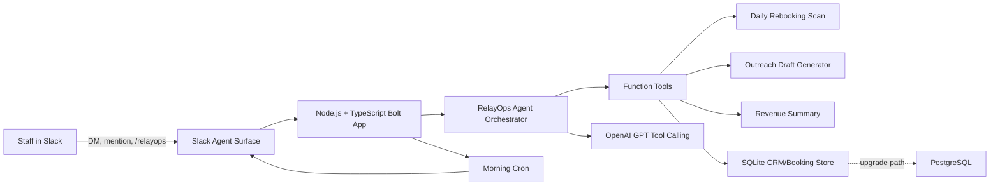

# RelayOps AI Rebooking Agent Architecture

## Data Flow

1. Booking and CRM records are imported into SQLite.
2. The daily scan ranks overdue customers by return-cycle gap, spend, loyalty, VIP status, and contact consent.
3. Slack receives a Block Kit report with high-value opportunities and action buttons.
4. Staff ask natural-language questions in Slack.
5. The agent calls structured tools for customer facts, then uses GPT only to reason over verified data and produce concise Slack-ready responses.
6. Outreach drafts and contact actions are logged for follow-up state.

## Production Upgrade Path

- Replace SQLite with PostgreSQL by swapping the repository layer in `src/db.ts`.
- Add booking-system connectors for Square, Fresha, Mindbody, Jane, ServiceTitan, Jobber, or dental PMS exports.
- Add a vector table for RAG over customer notes, campaigns, service policies, and staff playbooks.
- Add multi-tenant workspaces with row-level business isolation.
- Add audit logs, consent enforcement, and role-based Slack actions before broad commercial release.

