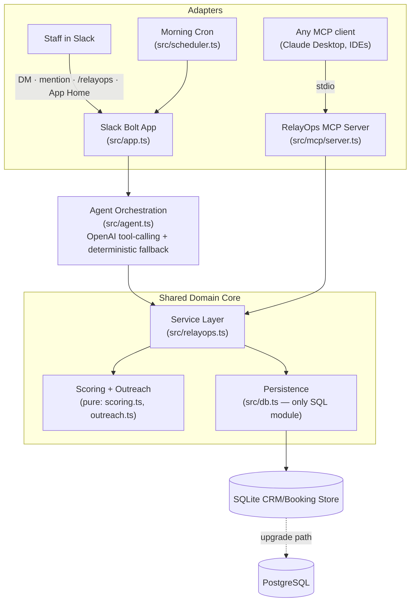

# RelayOps AI Rebooking Agent Architecture

The same **domain core** powers two independent adapters — the **Slack agent** and an **MCP server** — so RelayOps' rebooking intelligence is available both inside Slack and to any MCP client (Claude Desktop, etc.).

## Required-technology mapping (Slack Agent Builder Challenge)

- **MCP server integration** — `src/mcp/server.ts` exposes five tools (`get_rebooking_opportunities`, `summarize_today`, `draft_follow_up`, `list_recently_contacted`, `mark_contacted`) over stdio via `@modelcontextprotocol/sdk`. Runs credential-free.
- **Slack AI capabilities** — Slack Agents & AI-Apps surface: assistant threads with suggested prompts, streaming responses, and thinking status (`assistant_thread_started`, `setStatus`, `sayStream`).

## Data Flow

1. Booking and CRM records live in SQLite (seeded demo data; CSV/connector import on the roadmap).
2. The daily scan ranks overdue customers by return-cycle gap, spend, loyalty, VIP status, and consent, then **suppresses anyone contacted within the 14-day cooldown**.
3. Slack surfaces the results three ways: the `/relayops scan` Block Kit report, the App Home dashboard, and natural-language answers in DMs/mentions.
4. The agent calls structured service functions for every customer fact, using GPT only to reason over verified data (deterministic templates when no OpenAI key is set).
5. The MCP server calls the identical service layer, so an MCP client gets the same grounded answers as Slack.
6. Outreach drafts and contact actions are logged; the contact log now feeds back into scan suppression (closing the follow-up loop).

## Production Upgrade Path

- Replace SQLite with PostgreSQL by swapping the repository layer in `src/db.ts`.
- Add booking-system connectors for Square, Fresha, Mindbody, Jane, ServiceTitan, Jobber, or dental PMS exports.
- Add a vector table for RAG over customer notes, campaigns, service policies, and staff playbooks.
- Add multi-tenant workspaces with row-level business isolation.
- Add audit logs, consent enforcement, and role-based Slack actions before broad commercial release.

